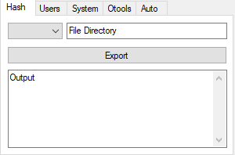
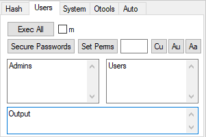
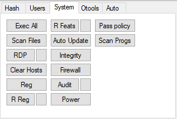
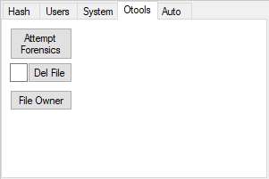

<div align="center">
  <h1>CyberPatriot Windows</h1>
  <p><em>GUI tool for securing Windows machines in CyberPatriot competitions</em></p>

  
  
</div>

---

Compiles many security hardening functions into a single GUI for use in [CyberPatriot](https://www.uscyberpatriot.org/) (2021). No longer maintained.

> **Warning** — Only run this on a VM. Do not run this on your own machine.

## Features

### File Hash

<div align="center">
  
</div>

Gives SHA (1, 256, 384, 512) or MD (2, 4, 5) hash of an input file.

### Users

<div align="center">
  
</div>

- **Exec All** — executes everything on this tab *(broken, do not use)*
- **m checkbox** — toggles manual mode for inputting admins and users manually *(untested)*
- **Secure Passwords** — sets a unique password for each user based on a template and their position
- **Set Perms** — parses the readme file and applies correct permissions *(broken, do not use)*
- **Cu** — creates a user given in the adjacent input box
- **Au** — assigns the User group to the specified user
- **Aa** — assigns the Admin group to the specified user

### System

<div align="center">
  
</div>

Square buttons revert settings to their less-secure defaults.

- **Exec All** — executes all scripts on this page *(not recommended)*
- **Scan Files** — scans the computer for notable file types and records them in a folder
- **RDP** — disables everything related to RDP and prompts with a disable GUI
- **Clear Hosts** — resets the Hosts file
- **Auto Update** — updates everything
- **Integrity** — runs the built-in Windows integrity scan
- **Firewall** — enables everything related to the firewall
- **Audit** — sets auditing settings
- **Power** — adjusts power settings
- **Pass Policy** — adjusts the password policy
- **Scan Progs** — scans installed programs and flags bad ones *(untested)*
- **R Reg** — disables remote registry

<details>
  <summary><strong>Reg</strong> — registry keys applied</summary>
  <br>

  ```
  HKLM\SOFTWARE\Microsoft\Windows\CurrentVersion\Policies\System, EnableLUA, 1
  HKLM\SOFTWARE\Policies\Microsoft\Windows\WindowsUpdate\AU, AutoInstallMinorUpdates, 1
  HKLM\SOFTWARE\Policies\Microsoft\Windows\WindowsUpdate\AU, NoAutoUpdate, 0
  HKLM\SOFTWARE\Policies\Microsoft\Windows\WindowsUpdate\AU, AUOptions, 4
  HKLM\SOFTWARE\Microsoft\Windows\CurrentVersion\WindowsUpdate\Auto Update, AUOptions, 4
  HKLM\SOFTWARE\Policies\Microsoft\Windows\WindowsUpdate, DisableWindowsUpdateAccess, 0
  HKLM\SOFTWARE\Policies\Microsoft\Windows\WindowsUpdate, ElevateNonAdmins, 0
  HKCU\SOFTWARE\Microsoft\Windows\CurrentVersion\Policies\Explorer, NoWindowsUpdate, 0
  HKLM\SYSTEM\Internet Communication Management\Internet Communication, DisableWindowsUpdateAccess, 0
  HKCU\SOFTWARE\Microsoft\Windows\CurrentVersion\Policies\WindowsUpdate, DisableWindowsUpdateAccess, 0
  HKLM\SOFTWARE\Microsoft\Windows NT\CurrentVersion\Winlogon, AllocateCDRoms, 1
  HKLM\SOFTWARE\Microsoft\Windows NT\CurrentVersion\Winlogon, AllocateFloppies, 1
  HKLM\SOFTWARE\Microsoft\Windows NT\CurrentVersion\Winlogon, AutoAdminLogon, 0
  HKLM\SYSTEM\CurrentControlSet\Control\Session Manager\Memory Management, ClearPageFileAtShutdown, 1
  HKLM\SYSTEM\CurrentControlSet\Control\Print\Providers\LanMan Print Services\Servers, AddPrinterDrivers, 1
  HKLM\SOFTWARE\Microsoft\Windows NT\CurrentVersion\Image File Execution Options\LSASS.exe, AuditLevel, 00000008
  HKLM\SYSTEM\CurrentControlSet\Control\Lsa, RunAsPPL, 00000001
  HKLM\SYSTEM\CurrentControlSet\Control\Lsa, LimitBlankPasswordUse, 1
  HKLM\SYSTEM\CurrentControlSet\Control\Lsa, auditbaseobjects, 1
  HKLM\SYSTEM\CurrentControlSet\Control\Lsa, fullprivilegeauditing, 1
  HKLM\SYSTEM\CurrentControlSet\Control\Lsa, restrictanonymous, 1
  HKLM\SYSTEM\CurrentControlSet\Control\Lsa, restrictanonymoussam, 1
  HKLM\SYSTEM\CurrentControlSet\Control\Lsa, disabledomaincreds, 1
  HKLM\SYSTEM\CurrentControlSet\Control\Lsa, everyoneincludesanonymous, 0
  HKLM\SYSTEM\CurrentControlSet\Control\Lsa, UseMachineId, 0
  HKLM\SOFTWARE\Microsoft\Windows\CurrentVersion\Policies\System, dontdisplaylastusername, 1
  HKLM\SOFTWARE\Microsoft\Windows\CurrentVersion\Policies\System, EnableLUA, 1
  HKLM\SOFTWARE\Microsoft\Windows\CurrentVersion\Policies\System, PromptOnSecureDesktop, 1
  HKLM\SOFTWARE\Microsoft\Windows\CurrentVersion\Policies\System, EnableInstallerDetection, 1
  HKLM\SOFTWARE\Microsoft\Windows\CurrentVersion\Policies\System, undockwithoutlogon, 0
  HKLM\SOFTWARE\Microsoft\Windows\CurrentVersion\Policies\System, DisableCAD, 0
  HKLM\SYSTEM\CurrentControlSet\services\Netlogon\Parameters, MaximumPasswordAge, 30
  HKLM\SYSTEM\CurrentControlSet\services\Netlogon\Parameters, DisablePasswordChange, 1
  HKLM\SYSTEM\CurrentControlSet\services\Netlogon\Parameters, RequireStrongKey, 1
  HKLM\SYSTEM\CurrentControlSet\services\Netlogon\Parameters, RequireSignOrSeal, 1
  HKLM\SYSTEM\CurrentControlSet\services\Netlogon\Parameters, SignSecureChannel, 1
  HKLM\SYSTEM\CurrentControlSet\services\Netlogon\Parameters, SealSecureChannel, 1
  HKLM\SYSTEM\CurrentControlSet\services\LanmanServer\Parameters, autodisconnect, 45
  HKLM\SYSTEM\CurrentControlSet\services\LanmanServer\Parameters, enablesecuritysignature, 0
  HKLM\SYSTEM\CurrentControlSet\services\LanmanServer\Parameters, requiresecuritysignature, 0
  HKCU\Software\Microsoft\Windows\CurrentVersion\Explorer\Advanced, ShowSuperHidden, 1
  HKLM\SYSTEM\CurrentControlSet\Control\CrashControl, CrashDumpEnabled, 0
  HKCU\SYSTEM\CurrentControlSet\Services\CDROM, AutoRun, 1
  HKCU\Software\Microsoft\Windows\CurrentVersion\Explorer\Advanced, Hidden, 1
  HKCU\Software\Microsoft\Windows\CurrentVersion\Internet Settings, WarnonZoneCrossing, 1
  HKCU\Software\Microsoft\Internet Explorer\Main\FeatureControl\FEATURE_LOCALMACHINE_LOCKDOWN\Settings, LOCALMACHINE_CD_UNLOCK, 1
  HKCU\Software\Microsoft\Internet Explorer\Download, RunInvalidSignatures, 1
  HKCU\Software\Microsoft\Internet Explorer\Main, DoNotTrack, 1
  HKCU\Software\Microsoft\Windows\CurrentVersion\Internet Settings, WarnOnPostRedirect, 1
  HKCU\Software\Microsoft\Windows\CurrentVersion\Internet Settings, WarnonBadCertRecving, 1
  HKCU\Software\Microsoft\Windows\CurrentVersion\Internet Settings, DisablePasswordCaching, 1
  HKCU\Software\Microsoft\Internet Explorer\PhishingFilter, EnabledV9, 1
  HKCU\Software\Microsoft\Internet Explorer\PhishingFilter, EnabledV8, 1
  HKLM\SYSTEM\CurrentControlSet\services\LanmanWorkstation\Parameters, EnablePlainTextPassword, 0
  HLU.DEFAULT\Control Panel\Accessibility\StickyKeys, Flags, 506
  HKLM\SYSTEM\CurrentControlSet\Control\SecurePipeServers\winreg\AllowedPaths, Machine, ""
  HKLM\SYSTEM\CurrentControlSet\Control\SecurePipeServers\winreg\AllowedExactPaths, Machine, ""
  HKLM\SYSTEM\CurrentControlSet\services\LanmanServer\Parameters, NullSessionPipes, ""
  HKLM\SYSTEM\CurrentControlSet\services\LanmanServer\Parameters, NullSessionShares, ""
  ```
</details>

<details>
  <summary><strong>R Feats</strong> — Windows features disabled</summary>
  <br>

  ```
  IIS-WebServerRole, IIS-WebServer, IIS-CommonHttpFeatures, IIS-HttpErrors,
  IIS-HttpRedirect, IIS-ApplicationDevelopment, IIS-NetFxExtensibility,
  IIS-NetFxExtensibility45, IIS-HealthAndDiagnostics, IIS-HttpLogging,
  IIS-LoggingLibraries, IIS-RequestMonitor, IIS-HttpTracing, IIS-Security,
  IIS-URLAuthorization, IIS-RequestFiltering, IIS-IPSecurity, IIS-Performance,
  IIS-HttpCompressionDynamic, IIS-WebServerManagementTools,
  IIS-ManagementScriptingTools, IIS-IIS6ManagementCompatibility, IIS-Metabase,
  IIS-HostableWebCore, IIS-StaticContent, IIS-DefaultDocument,
  IIS-DirectoryBrowsing, IIS-WebDAV, IIS-WebSockets, IIS-ApplicationInit,
  IIS-ASPNET, IIS-ASPNET45, IIS-ASP, IIS-CGI, IIS-ISAPIExtensions,
  IIS-ISAPIFilter, IIS-ServerSideIncludes, IIS-CustomLogging,
  IIS-BasicAuthentication, IIS-HttpCompressionStatic, IIS-ManagementConsole,
  IIS-ManagementService, IIS-WMICompatibility, IIS-LegacyScripts,
  IIS-LegacySnapIn, IIS-FTPServer, IIS-FTPSvc, IIS-FTPExtensibility,
  TFTP, TelnetClient, TelnetServer
  ```
</details>

### Otools

<div align="center">
  
</div>

- **Attempt Forensics** — reads forensics files and answers them if possible
- **Del file** — deletes the given directory
- **File Owner** — gives the file owner of the selected file
